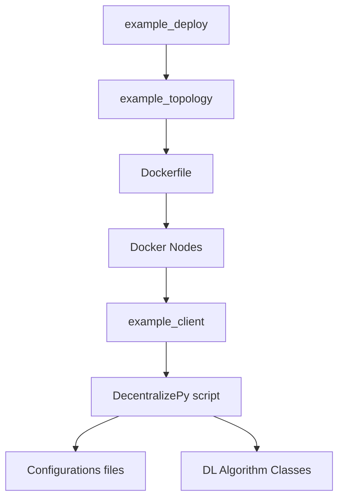

# Setup - Install Dependencies

1. **Decentralizepy**: Follow the instructions at [Decentralizepy GitHub](https://github.com/sacs-epfl/decentralizepy) to install the package for simulating distributed learning (DL) algorithms.

2. **Docker and Kollaps**: Install Docker and Kollaps to simulate nodes and control network properties. Follow the tutorial at [Decentra-learn GitLab](https://gitlab.epfl.ch/sacs/decentra-learn/-/blob/main/tuto.md?ref_type=heads).

3. **Async DP Package**: Navigate to the `async-dp` folder and run the following command to install the package:
    ```sh
    pip3 install --editable .
    ```

# Deployment and Training Workflow

This guide explains how the deployment and distributed deep learning training pipeline works, step by step, including a diagram for better understanding. Please refer to each mentioned files to modify them and reproduce or make your own experiments. 

## Step-by-Step Workflow

1. **Initialize Deployment Script**
   - The process starts with `scripts/example_deploy.py`.
   - This script initializes the deployment of a network of nodes based on a predefined topology.
   
2. **Specify Node Topology**
   - The topology is defined in `topologies/example_topology.xml`.
   - This file specifies the structure and connections of the nodes in the network.
   - The file must be converted to a `.yaml` read by Docker and Kollaps, don't forget to include volumes or mounted directories if you store your logs from the containers to a shared memory system.

3. **Prepare Docker Environment**
   - The `Dockerfile` is used to:
     - Install required libraries.
     - Copy necessary data and dependencies into the container environment.

4. **Deploy and Launch Docker Nodes**
   - The Docker nodes are started, each representing a node in the network.
   - These nodes are configured to execute specific tasks.

5. **Run Client Script**
   - Each Docker node runs `scripts/example_client`.
   - This script launches the distributed deep learning (DL) training process.
   - At the end, it tests the model and store the results and logs in the mounted folder

6. **Training Workflow**
   - The DL training is managed through the `async-dp/tutorial` script.
     - It reads configurations from `async-dp/tutorial`.
     - It uses classes stored in `async-dp/src/` to define the DL algorithm and its behavior.
      - By default, the script `async-dp/tutorial/example_run` launches DivShare. To test baselines, modify `eval_file` in the script.

---

## System Diagram



This diagram visualizes the flow of the system, starting from deployment initialization to the execution of deep learning training on the Docker nodes.

# Citing

Cite us as : (DOI from ACM WWW not released yet)

@misc{biswas2024boostingasynchronousdecentralizedlearning,
      title={Boosting Asynchronous Decentralized Learning with Model Fragmentation}, 
      author={Sayan Biswas and Anne-Marie Kermarrec and Alexis Marouani and Rafael Pires and Rishi Sharma and Martijn De Vos},
      year={2024},
      eprint={2410.12918},
      archivePrefix={arXiv},
      primaryClass={cs.DC},
      url={https://arxiv.org/abs/2410.12918}, 
}

# Contact

Code written by Alexis Marouani in 2024
