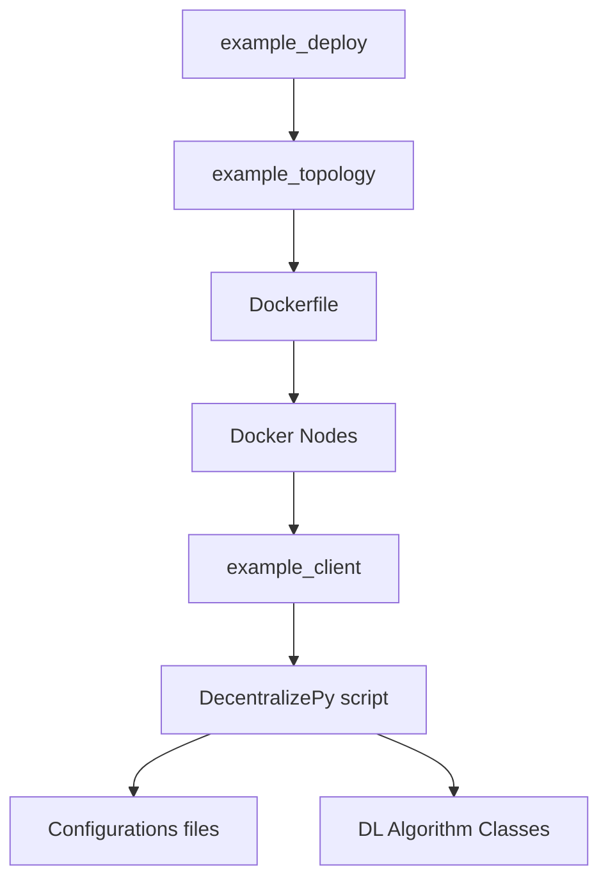

# DivShare
Repository for the artifact of *[Boosting Asynchronous Decentralized Learning with Model Fragmentation](https://arxiv.org/pdf/2410.12918)* published at The ACM Web Conference (WWW) 2025.

Decentralized learning (DL) is an emerging technique that allows nodes on the web to collaboratively train machine learning models without sharing raw data. Dealing with stragglers, i.e., nodes with slower compute or communication than others, is a key challenge in DL. We present DivShare, a novel asynchronous DL algorithm that achieves fast model convergence in the presence of communication stragglers. DivShare achieves this by having nodes fragment their models into parameter subsets and send, in parallel to computation, each subset to a random sample of other nodes instead of sequentially exchanging full models. The transfer of smaller fragments allows more efficient usage of the collective bandwidth and enables nodes with slow network links to quickly contribute with at least some of their model parameters. By theoretically proving the convergence of DivShare, we provide, to the best of our knowledge, the first formal proof of convergence for a DL algorithm that accounts for the effects of asynchronous communication with delays. We experimentally evaluate DivShare against two state-of-the-art DL baselines, AD-PSGD and Swift, and with two standard datasets, CIFAR-10 and MovieLens. We find that DivShare with communication stragglers lowers time-to-accuracy by up to 3.9x compared to AD-PSGD on the CIFAR-10 dataset. Compared to baselines, DivShare also achieves up to 19.4% better accuracy and 9.5% lower test loss on the CIFAR-10 and MovieLens datasets, respectively.
 

## Setup - Install Dependencies

1. **Decentralizepy**: Follow the instructions at [Decentralizepy GitHub](https://github.com/sacs-epfl/decentralizepy) to install the package for simulating distributed learning (DL) algorithms.

2. **Docker and Kollaps**: Install Docker and Kollaps to simulate nodes and control network properties. Follow the tutorial at [Decentra-learn GitLab](https://gitlab.epfl.ch/sacs/decentra-learn/-/blob/main/tuto.md?ref_type=heads).

3. **Async DP Package**: Navigate to the `async-dp` folder and run the following command to install the package:
    ```sh
    pip3 install --editable .
    ```

## Deployment and Training Workflow

This guide explains how the deployment and distributed deep learning training pipeline works, step by step, including a diagram for better understanding. Please refer to each mentioned files to modify them and reproduce or make your own experiments. 

### Step-by-Step Workflow

1. **Initialize Deployment Script**
   - The process starts with `scripts/example_deploy.py`.
   - This script initializes the deployment of a network of nodes based on a predefined topology.
   
2. **Specify Node Topology**
   - The topology is defined in `topologies/example_topology.xml`.
   - This file specifies the structure and connections of the nodes in the network.
   - The file must be converted to a `.yaml` read by Docker and Kollaps, don't forget to include volumes or mounted directories if you store your logs from the containers to a shared memory system.

3. **Prepare Docker Environment**
   - The `Dockerfile` is used to:
     - Install required libraries.
     - Copy necessary data and dependencies into the container environment.

4. **Deploy and Launch Docker Nodes**
   - The Docker nodes are started, each representing a node in the network.
   - These nodes are configured to execute specific tasks.

5. **Run Client Script**
   - Each Docker node runs `scripts/example_client`.
   - This script launches the distributed deep learning (DL) training process.
   - At the end, it tests the model and store the results and logs in the mounted folder

6. **Training Workflow**
   - The DL training is managed through the `async-dp/tutorial` script.
     - It reads configurations from `async-dp/tutorial`.
     - It uses classes stored in `async-dp/src/` to define the DL algorithm and its behavior.
      - By default, the script `async-dp/tutorial/example_run` launches DivShare. To test baselines, modify `eval_file` in the script.

---

### System Diagram



This diagram visualizes the flow of the system, starting from deployment initialization to the execution of deep learning training on the Docker nodes.

## Citation

Cite us as :
```
@inproceedings{biswas2025boosting,
  title={Boosting Asynchronous Decentralized Learning with Model Fragmentation},
  author={Biswas, Sayan and Kermarrec, Anne-Marie and Marouani, Alexis and Pires, Rafael and Sharma, Rishi and de Vos, Martijn},
  booktitle={Proceedings of the ACM on Web Conference (WWW)},
  year={2025},
  url={https://arxiv.org/abs/2410.12918}
}
```

## Contact us

For any questions or concerns, please feel free to create a Github issue on the repository.

## License

Artifact contributed by [Alexis Marouani](https://github.com/Alexyyym). This project is licensed under the MIT License. See the `LICENSE` file for more details.
